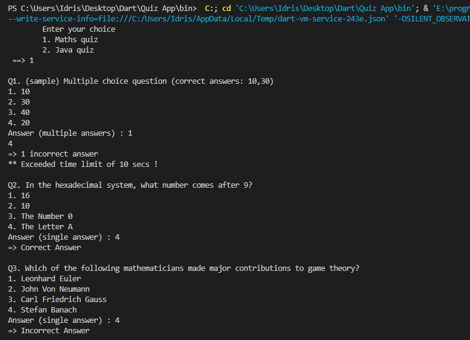
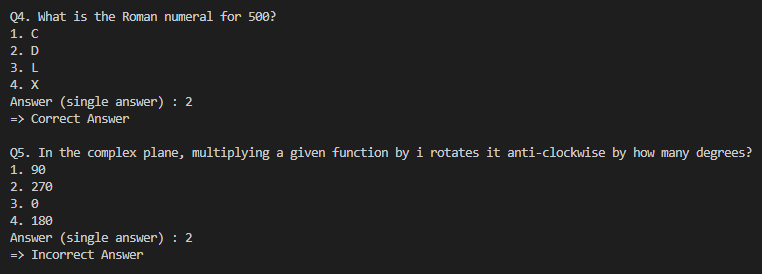
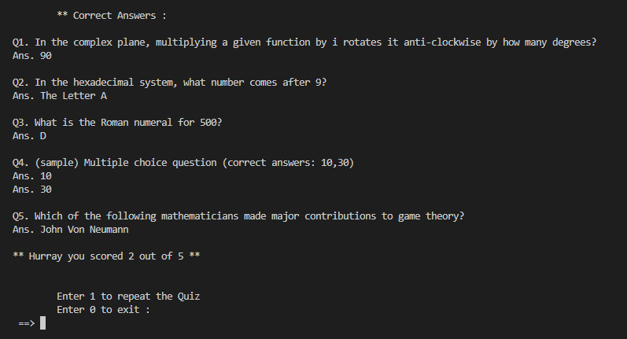

# Quiz Console App

A basic cli application to learn fundamentals of dart language. It uses various concepts of oops, datatypes, packages and asynchronous Workflow.

## Features

- Questions and options are in randomized order
- Multiple options as answer
- Quiz data is stored in JSON
- A time limit of 10s is alloted to every question
- Score is calculated
- Correct answers are displayed in the end

## Screenshots

